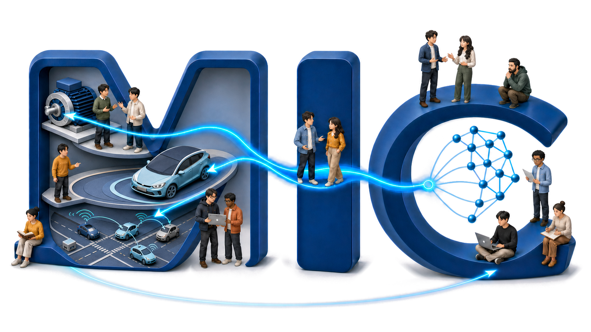

## <b>Mobility Intelligence and Control Laboratory</b>
<!-- {: .welcomefont} -->
#### KAIST CCS Graduate School of Mobility
<!-- {: .welcomefont} -->

 
 

<!-- 

  <a href="{{ '/join/phd_join/' | relative_url }}" style="display: inline-block; padding: 14px 26px; background-color: #fff3f3; border: 1px solid #ffcccc; border-radius: 8px; text-decoration: none; line-height: 1.6;">
    박사후연구원 채용 
    기후에너지환경부 인재 양성 사업 지원 
    Electric Drive 및 Power Electronics Control 분야 
    (클릭하여 세부 정보 보기)
  </a>

 -->

<i>
Advancing mobility intelligence through optimal and learning-based control from components to vehicles and mobility systems.
</i>
<!-- {: .welcomefont} -->

 

  

